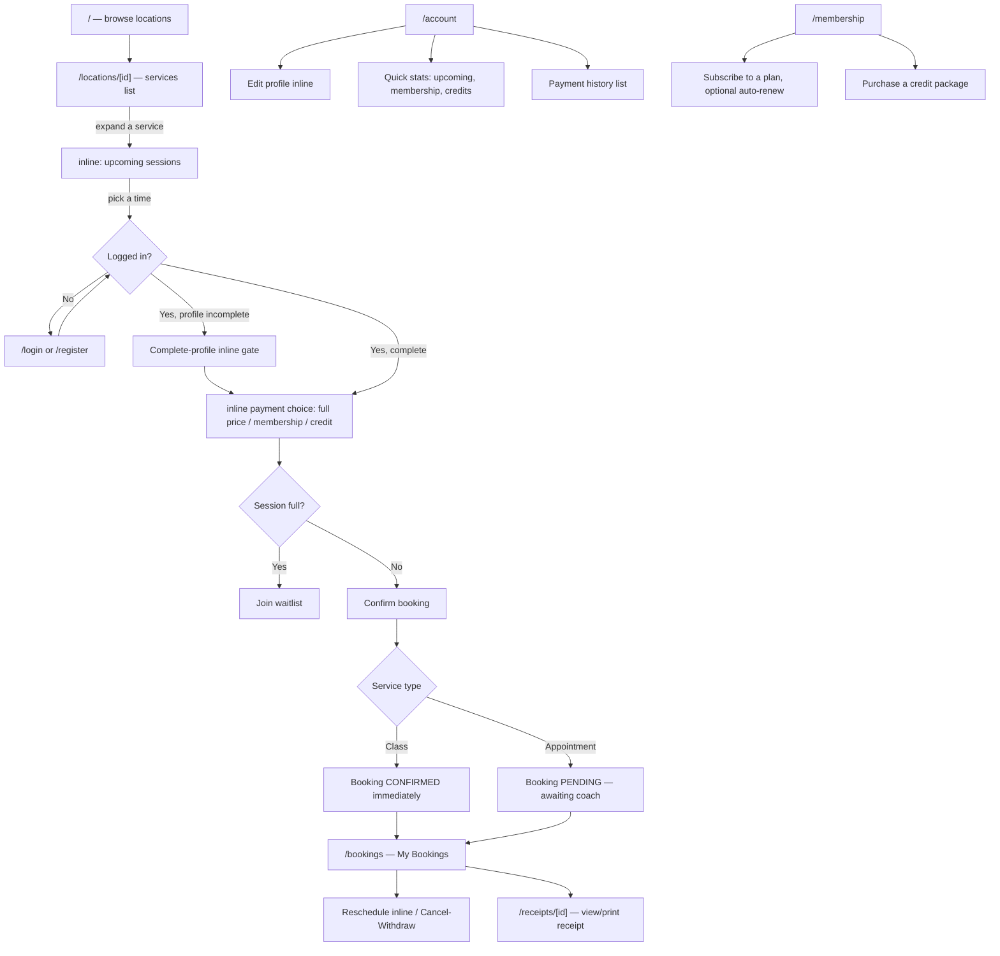
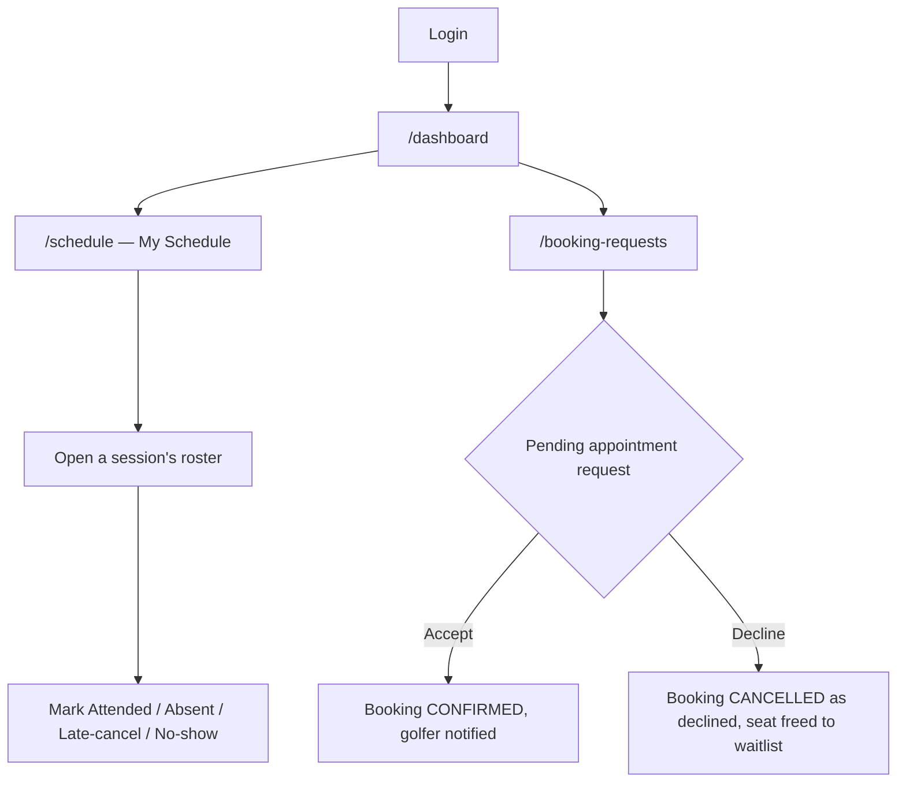
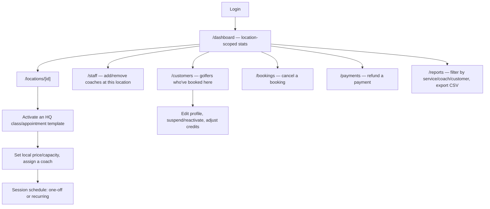
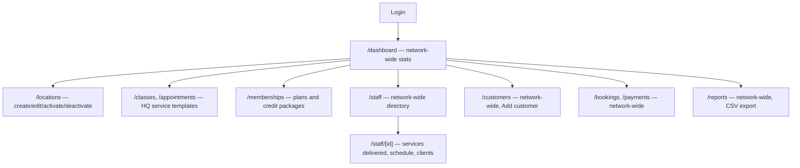

# User Flows (as-built)

Status: closes spec §26's wireframe requirement retroactively. That
deliverable list was meant to be produced *before* development started, as
a proposal to get sign-off on; this project instead built first and is
documenting the result after the fact. These are flow diagrams of the actual
shipped routes, not pre-build wireframes — treat them as an as-built map for
onboarding/QA, not evidence the original approval gate was followed.

## Golfer / Customer (`apps/web`)

## Coach / Staff (`apps/admin`, COACH role)

A coach's sidebar only ever shows Dashboard, My Schedule, and Booking
Requests — every HQ/Location-Admin-only page (Locations, Staff, Classes,
Reports, Bookings, Customers, Payments) is hidden by role, not just
soft-disabled (`apps/admin/src/components/Sidebar.tsx`).

## Location Admin (`apps/admin`, LOCATION_ADMIN role)

## HQ Admin (`apps/admin`, HQ_ADMIN role)

## What these diagrams intentionally don't cover

- Error/edge states (expired session, declined payment, capacity races) —
  those are documented in code comments at the point they're handled, not
  duplicated here.
- The Stripe payment-collection UI itself, since it's a third-party embedded
  element (`StripePaymentPanel`), not a G50-built screen.
